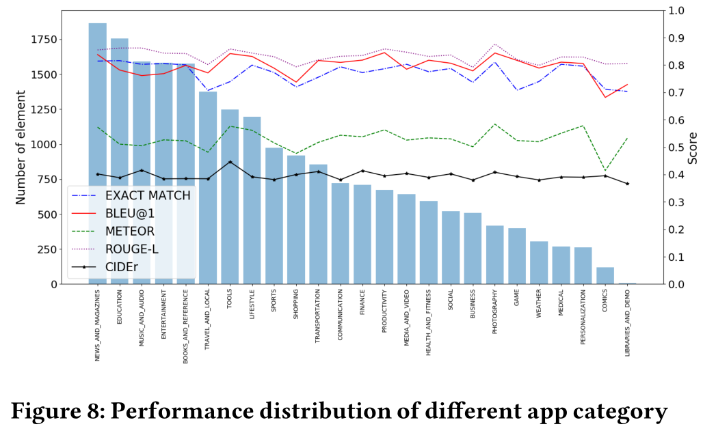
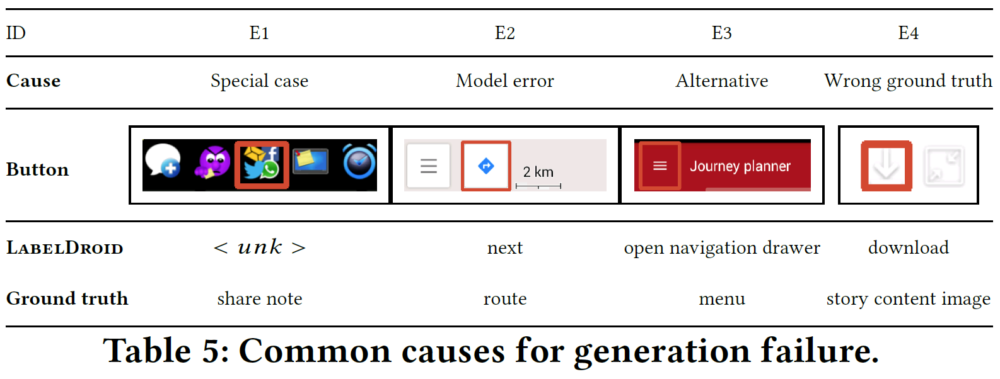

# Unblind Your Apps: Predicting Natural-Language Labels for Mobile GUI Components by Deep Learning

**Accepted to ICSE2020. ACM SIGSOFT Distinguished Paper Award.**

## Resource

- Paper: [arXiv](https://arxiv.org/abs/2003.00380)

- Video: [Youtube](https://www.youtube.com/watch?v=zoRu7UOXAeY&list=PLh7v-bsdypMGkREL9PPVczHtaVLlL4P5h&index=4) / [iQiYi](https://www.iqiyi.com/v_19rzke53xo.html)

- PPT: [ICSE-jieshan.pptx](ICSE-jieshan.pptx)

- Blog: [Chinese](https://zhuanlan.zhihu.com/p/158444845)

- Dataset for training/validating/testing model: [Google Drive](https://drive.google.com/open?id=19KG0eX7311EbpMnqGEXzAOYG2n3zZWqp)

- Raw dataset for the motivational mining study: [Dropbox](https://www.dropbox.com/sh/kfkhevxykzwputb/AAAhL6ipmOg4zZn4jUL_myF0a?dl=0)

- Code: Please contact me via my email (Jieshan.Chen@anu.edu.au)

## INTRODUCTION
According to the World Health Organization(WHO), it is estimated that <b> approximately 1.3 billion people live with some form of vision impairment globally, of whom 36 million are blind.</b>
Due to their disability, engaging these minority into the society is a challenging problem.

The recent rise of smart mobile phones provides a new solution by enabling blind users' convenient access to the information and service for understanding the world. Users with vision impairment can adopt the screen reader embedded in the mobile operating systems to read the content of each screen within the app, and use gestures to interact with the phone.

However, the prerequisite of using screen readers is that developers have to add natural-language labels to the image-based components when they are developing the app. Unfortunately, <b>more than 77\% apps have issues of missing labels, according to our analysis of 10,408 Android apps.</b> Most of these issues are caused by developers' lack of awareness and knowledge in considering the minority. And even if developers want to add the labels to UI components, they may not come up with concise and clear description as most of them are of no visual issues. 

To overcome these challenges, we develop a deep-learning based model to <b> automatically predict the labels of image-based buttons by learning from large-scale commercial apps in Google Play.</b>
The experiment results show that our model can make accurate predictions and the generated labels are of higher quality than that from real Android developers.
We also submit our predicted labels of buttons of some apps to their development teams, and successfully get some positive feedback.

### Details
To demonstrate our task, we first show some examples to illustrate what is natural-language labels for components and how to set up labels for components.

(1) Figure 1 shows an example of UI components and corresponding natural-language labels. For example, the label for the top-right image-based button of this UI screenshot is ''more options''

(2) Figure 2 shows how to set up an image-based button within the source code

We only focus on image-based buttons because these buttons give no hints to screen reader when developers fail to label them, while for other components, such as TextView and EditText, screen reader could read the content directly.

(3) Figure 3 gives some examples of image-based buttons, including clickable ImageView and ImageButton

## MOTIVATIONAL MINING STUDY

To investigate the severity of accessibility issues in mobile applications, we conduct a motivational mining study of <b>15,087</b> apps. Among these apps, we collected <b>394,489 GUI screenshots</b>, and 70.53% of them contain image-based buttons.</b>

**NUMBERS**

We have crawled _19,127 apps_, with _15,089_ succeeding in collecting GUIs. After duplicate screenshot removal, *394,489* screenshots from *15,089* apps left. Within them, *278,234*(70.53%) of them from **10,408** apps contain image-based buttons. These 10,408 apps are the main dataset for analysis in Section 3. Within these *10,408* apps, *7,814* of them contain image buttons and *7,421* apps contain clickable images. 

As shown in Table 1, <b>77.38% of applications</b> have at least one UI component lacking labels. In details, <b>60.79% screenshots</b> have at least one UI component missing labels, which means that low-vision/blind people will meet some problems when browsing every two screen of application.

As seen in Figure 4, the accessibility issues exist in all categories, especially serious in PERSONALIZATION and GAME, with over 70% applications having 80%-100% components lacking lables.

In addition, we plot a box-plot regarding to different download number (as seen in Figure 5). Surprisingly, there is      
<b>no significant difference</b> between applications with different download numbers. Even applications with over 50M download number have a severe accessibility problem. We conducted a Spearman rank-order correlation test between app download number and label-missing
rate. The correlation coefficient is 0.046 showing a very weak relationship between these two factors.

## APPROACH
Figure 6 shows the overview of our approach. We first encode a component image via ResNet101 model, and then feed the extracted features into Transformer encoder-decoder model and finally generate the natural-language labels for this component.

## DATA PREPROCESSING
To implement our model, we first filter noisy data to construct our dataset.

Preprocessing:
- Filter duplicate xml
- Filter duplicate elements by comparing both their screenshots and the content descriptions
- Filter low-quality labels
  - Labels contain the class of elments, e.g, "ImageView"
  - Labels contain the app's name, e.g., "ringtone maker" for App Ringtone Maker
  - Unfinished labels, e.g., "content description"

*The full list of meaningless labels can be seen at [meaningless_label](./meaningless_label.txt)*

## DATASET
Figure 7 shows some examples in our dataset.

Table 2 shows the statistics of our dataset. In total, we collect 7,594 applications, 13,145 screenshots and 19,233 components. Besides, we split our dataset into train/val/test set, with the approximate ratio of 0.8/0.1/0.1.

*The full dataset can be downloaded via [Google Drive](https://drive.google.com/open?id=19KG0eX7311EbpMnqGEXzAOYG2n3zZWqp)*

## EVALUATION
We evaluate our model in three aspects, i.e., accuracy with automated testing, generalization and usefulness with user study. We also shows the practical value of LabelDroid by submitting the labels to app development teams.

### Accuracy

Overall accuracy results

#### Wilcoxon rank sum test for accuracy evaluation

To evalute whether the differences are significant, we further conduct the <b>Wilcoxon rank-sum test</b> between LabelDroid and CNN+LSTM and CNN+CNN respectively in all testing metrics (BLEU@1,2,3,4, METEOR, ROUGE-L, CIDEr). We then use Benjamini&Hochberg(BH) method to correct p-values for multiple comparisons. Results show that <b>the improvement of our model is significant in all comparisons</b>, and the detailed corrected p-values are listed below.

|                | BLEU@1 | BLEU@2  | BLEU@3 | BLEU@4 | METEOR  | ROUGE-L | CIDEr |
| ------------- | ------------- | ------------- | ------------- | ------------- | ------------- | ------------- | ------------- |
| LabelDroid v.s. CNN+LSTM  | 0.0017 | 0.0023  | 0.0061 | 0.0062 | 0.00093 | 0.00097 | 0.0014 |
| LabelDroid v.s. CNN+CNN   | 0.0017 | 0.00096 | 0.0033 | 0.0029 | 0.00083 | 0.00093 | 0.0014 |
| CNN+LSTM v.s. CNN+CNN     | 0.88   | 0.62    | 0.66   | 0.63   | 0.83    | 0.85    | 0.88   |

Results by different category

Qualitative Performance with Baselines

Common causes for generation failure

### Generalization & Usefulness

App details and results:

#### Wilcoxon signed-rank test

To understand the significance of the differences between four kinds of content description, we carry out the Wilcoxon signed-rank test between the scores of our model and each annotator. We then use Benjamini&Hochberg(BH) method to correct p-values for multiple comparisons, and compute effect size r=Z/sqrt(N), where Z is the statisctical result from test and N is the number of observations. The results show that the differences between our model and A1, A2, A3 are mostly significant (p-value<0.05). Detailed results are listed below.

|            | Corrected p-value | Effect size  |
| ---------- | -------- | ------------- | 
| M v.s. A1  | 0.000047 | 0.39  |
| M v.s. A2  | 0.0061   | 0.29  | 
| M v.s. A3  | 0.039    | 0.12  | 
| A3 v.s. A1 | 0.029    | 0.23  | 
| A3 v.s. A2 | 0.0046   | 0.19  | 
| A2 v.s. A1 | 0.77     | 0.086 | 

[Generalization&Usefulness](assets/Generalization%26Usefulness) contains all data we used in this part and the results from model(M), developers(A1,A2,A3) and Evaluator.

